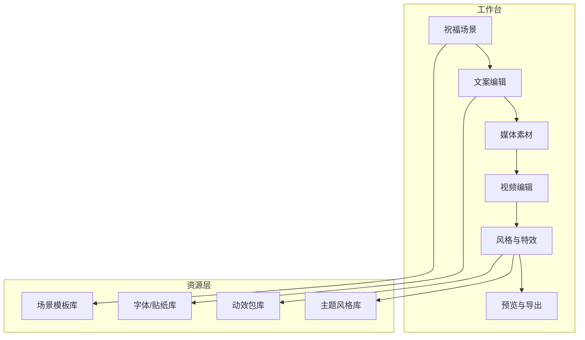
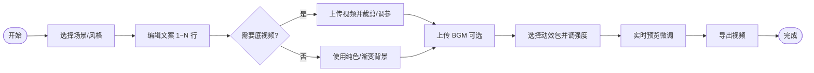
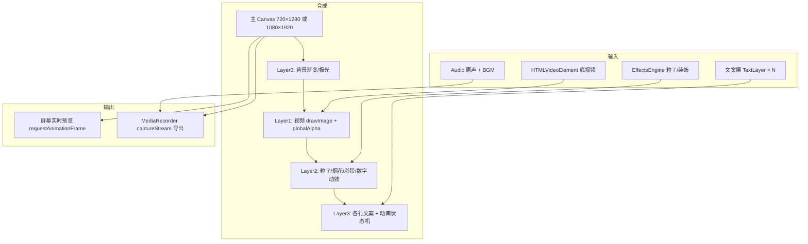
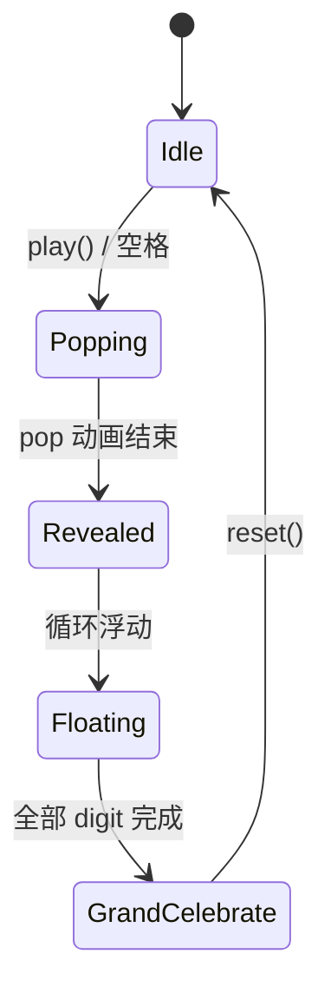

# 锦言 · 视频祝词工坊 — 产品功能设计文档

> 版本：v1.0 · 设计阶段  
> 参考素材：`Desktop/demo/demo.html`（生日浪漫风）、`Desktop/demo/index.html`（赛博数字风）  
> 历史实现参考：Git `eee7ef3`（锦言祝词特效工坊 Web 版）

---

## 1. 产品定位

**一句话**：在浏览器中完成「底视频 + 背景音乐 + 多层定制文案 + 可选炫酷特效」的合成与导出，面向生日、婚礼、毕业、节日等祝福场景，也支持赛博、古风等视觉风格。

**目标用户**：个人用户、小型活动运营、自媒体祝福短视频制作。

**核心价值**：

| 维度 | 说明 |
|------|------|
| 低门槛 | 上传即用，模板 + 风格一键套用 |
| 强表现 | 继承 demo 级 Canvas/CSS 粒子、数字弹跳、冲击波等动效 |
| 可定制 | 多行文案独立样式；视频裁剪与混音参数可调 |
| 可导出 | 实时预览与导出画面一致（Canvas + MediaRecorder） |

---

## 2. 设计图总览

### 2.1 信息架构（站点地图）



### 2.2 主界面线框（三栏布局）

```
┌──────────────────────────────────────────────────────────────────────────────┐
│  🎬 锦言视频祝词工坊                    [随机灵感]  [保存草稿]  [帮助]       │
├──────────────────┬───────────────────────────────────────┬───────────────────┤
│  左侧 · 创作控制  │  中央 · 实时预览                       │  右侧 · 时间轴   │
│  (~320px)        │  (flex, 9:16 竖屏为主)                 │  (可折叠 ~280px) │
│                  │                                       │                   │
│ 01 祝福场景      │  ┌─────────────────────────┐          │  ▶ 00:00 / 00:15  │
│ [过年][生日]…    │  │                         │          │  ├─ 片头特效 2s   │
│                  │  │   Canvas 合成层          │          │  ├─ 视频轨       │
│ 02 文案          │  │   · 底视频(可调透明)     │          │  ├─ 文案轨 L1-Ln │
│ [+ 增加一行]     │  │   · 粒子/烟花/数字动效   │          │  └─ BGM 轨       │
│ 行1 [样式▼]      │  │   · 多行祝词文字         │          │                   │
│ 行2 …            │  │                         │          │  [吸附对齐]       │
│                  │  └─────────────────────────┘          │                   │
│ 03 媒体上传      │  [实时特效预览 ●] 生日·数字弹跳        │                   │
│ 🎬 视频 🎵 音乐  │  [⛶ 全屏] [▶ 播放] [⟳ 重播动效]      │                   │
│                  │                                       │                   │
│ 04 视频编辑      │  导出进度仅在工具栏显示，不遮挡预览      │                   │
│ 裁剪/音量/透明   │                                       │                   │
│                  │                                       │                   │
│ 05 风格与特效    │                                       │                   │
│ [主题卡片网格]   │                                       │                   │
│ [动效子类多选]   │                                       │                   │
│ 强度 ━━━●━━      │                                       │                   │
└──────────────────┴───────────────────────────────────────┴───────────────────┘
│                        [导出 MP4]  [导出 GIF 封面]  [复制分享链接]              │
└──────────────────────────────────────────────────────────────────────────────┘
```

### 2.3 用户主流程



### 2.4 渲染合成管线



---

## 3. 功能模块详述

### 3.1 主体功能：视频制作

| 功能 | 说明 | 优先级 |
|------|------|--------|
| 上传视频 | 支持 mp4 / webm / mov；显示文件名、时长、分辨率 | P0 |
| 上传音乐 | 支持 mp3 / wav / m4a；与视频原声混音 | P0 |
| 文案制作 | 场景模板一键填充 + 自由编辑 | P0 |
| 特效选择 | 按「主题风格 + 动效子类」二维选择，实时预览 | P0 |
| 导出视频 | WebM/MP4（视浏览器编码器）；进度条不遮挡画布 | P0 |
| 无视频模式 | 仅渐变背景 + 特效 + 文案（兼容 demo 纯动效场景） | P1 |

**与 demo 的对应关系**（动效包设计，不限于下列两种）：

| 动效包 ID | 名称 | 来源参考 | 核心表现 |
|-----------|------|----------|----------|
| `fx-digit-pop-romantic` | 浪漫数字弹跳 | demo.html | 数字/关键字逐字 `pop`、冲击波、心形爆发、全屏闪白、身体轻震 |
| `fx-digit-pop-cyber` | 赛博数字弹跳 | demo/index.html | 霓虹渐变数字、`screen-shake`、星形飞散、粒子爆发、网格透视背景 |
| `fx-confetti-classic` | 经典彩带雨 | 两者共有 | Canvas 矩形/心形彩带、重力与旋转 |
| `fx-firework-burst` | 烟花绽放 | demo.html | 多点烟花 + 拖尾粒子 |
| `fx-aurora-bg` | 极光背景 | demo.html | CSS/Canvas 径向渐变漂移 |
| `fx-particle-starfield` | 星空粒子 | demo.html | 上升星点与光点 |
| `fx-neon-grid` | 霓虹网格 | demo/index.html | 透视网格动画 + 色相漂移 |
| `fx-shockwave-flash` | 冲击波+闪光 | 两者共有 | 可绑定到「关键字落地」时间点 |
| `fx-text-shimmer` | 标题流光 | demo.html | 渐变文字 background-position 动画 |
| `fx-subtitle-reveal` | 副标题入场 | 两者 | 字间距展开、上移淡入 |

> **选择交互**：右侧预览区顶部展示当前「主题 + 动效包」；左侧「风格与特效」区用**分类 Tab + 卡片网格**，卡片内含 3~5 秒循环缩略动画（GIF 或迷你 Canvas），点击即切换并触发 `replay` 预览。

---

### 3.2 视频编辑

在已上传视频后展开「视频调节」面板（历史版本已有裁剪滑块，本设计扩展如下）：

| 参数 | 控件 | 范围/默认 | 说明 |
|------|------|-----------|------|
| **时间裁剪** | 双滑块时间轴 + 入点/出点数值 | 0 ~ 视频时长 | 只导出 `[trimStart, trimEnd]` 片段；轨道可视化选区 |
| **播放速度** | 滑块 | 0.25× ~ 2.5×，默认 1× | 影响预览与导出时长 |
| **视频原声音量** | 滑块 | 0 ~ 100%，默认 80% | Web Audio GainNode |
| **背景音乐音量** | 滑块 | 0 ~ 100%，默认 70% | 与原声独立 |
| **视频透明度** | 滑块 | 0 ~ 100%，默认 85% | 透出下层渐变/粒子，适合「画中画祝福」 |
| **特效层透明度** | 滑块 | 20 ~ 100% | 粒子不压过文案 |
| **文案整体透明度** | 滑块 | 0 ~ 100% | 作用于所有文字层 |
| **单行透明度** | 每行独立滑块 | 0 ~ 100% | 见 3.4 |
| **画面裁切（画面比例）** | 预设 9:16 / 1:1 / 16:9 | 默认 9:16 | `object-fit: cover` + 可拖拽取景框（P1） |
| **滤镜** | 预设：原片 / 暖色 / 冷色 / 黑白 / 高对比 | — | Canvas 后处理或 CSS filter（P2） |
| **淡入淡出** | 视频/音频各 0~2s | 默认 0.3s | 片段首尾过渡（P1） |
| **静音原声** | 开关 | — | 仅保留 BGM |

**时间轴交互（推荐）**：

```
视频轨:  |████████████████████░░░░░░|  ← 灰色=裁掉
         ^trimStart            trimEnd^
文案轨:      [行1: 0.5s-3s]  [行2: 2s-8s]
BGM轨:   |══════════════════════════════|
```

---

### 3.3 视觉效果与主题风格

采用 **「主题风格（Skin）」×「动效包（FX Pack）」** 解耦：

- **主题风格**：决定配色、字体、背景、默认文案模板、装饰 emoji/印章。
- **动效包**：决定粒子类型、数字动画、是否震屏等，可跨主题复用。

#### 3.3.1 主题风格库（首批）

| 分类 | 主题 ID | 名称 | 视觉关键词 |
|------|---------|------|------------|
| 节庆贺岁 | `newyear` | 新春过年 | 金红、灯笼、烟花 |
| 节庆贺岁 | `birthday` | 生日派对 | 粉紫、蛋糕、气球（贴近 demo.html） |
| 节庆贺岁 | `festival` | 端午风情 | 艾草绿、龙舟 |
| 节庆贺岁 | `business` | 开业旺铺 | 金红、财源 |
| 人生喜事 | `wedding` | 浪漫婚礼 | 玫瑰金、花瓣 |
| 人生喜事 | `graduate` | 青春毕业 | 深蓝、学士帽、星辰 |
| 人生喜事 | `house` | 乔迁之喜 | 暖黄、家居 |
| 视觉风格 | `cyber` | 赛博霓虹 | 黑底、网格、霓虹（贴近 demo/index.html） |
| 视觉风格 | `guofeng` | 国风雅致 | 宣纸色、水墨、印章 |
| 视觉风格 | `romantic` | 浪漫梦幻 | 柔粉、光斑 |
| 视觉风格 | `dream` | 童话梦境 |  pastel、泡泡 |

每个主题卡片展示：**图标 + 名称 + 副标题 + 3 色条 + 迷你动效预览**。

#### 3.3.2 动效展示多样化要求

1. **分类浏览**：节庆粒子 / 数字动画 / 屏幕反馈 / 文字动画 / 背景氛围。  
2. **组合模式**：同一主题下可多选 1 个主特效 + 1 个背景特效（避免性能过载）。  
3. **强度滑块**：0.4 ~ 1.5，控制粒子数量、触发频率。  
4. **重播按钮**：不重新上传素材，仅重启动效时间轴（对应 demo「再来一遍」）。  
5. **关键字驱动**（P1）：文案中 `{0}` 或高亮词与数字弹跳序列绑定，如「1008」逐字弹出。

---

### 3.4 自定义文案（多行 + 行级定制）

#### 3.4.1 文案结构模型

```typescript
interface TextLine {
  id: string;
  content: string;
  role: "title" | "subtitle" | "body" | "signature" | "digit"; // digit=大数字强调
  style: {
    fontFamily: string;
    fontSize: number;        // px @ 导出分辨率
    fontWeight: number;
    color: string;
    gradient?: string[];     // 渐变字
    opacity: number;         // 0~1
    letterSpacing: number;
    textAlign: "left" | "center" | "right";
    shadow: boolean;
    strokeWidth: number;
  };
  animation: {
    preset: "none" | "fadeUp" | "shimmer" | "typewriter" | "digitPop" | "bounce";
    delayMs: number;
    durationMs: number;
  };
  layout: {
    x: number;               // 0~1 相对画布
    y: number;
    maxWidth: number;
  };
  visible: boolean;
  timeRange?: { startMs: number; endMs: number }; // 可选，绑定时间轴
}
```

#### 3.4.2 交互设计

| 操作 | 行为 |
|------|------|
| 「+ 增加一行」 | 追加默认 `body` 行，最多 8 行 |
| 拖拽排序 | 调整叠放顺序与出现节奏 |
| 行折叠面板 | 展开后：内容、角色、字体、颜色、透明度、动画、位置 |
| 双击预览区文字 | 进入拖拽定位（吸附安全区） |
| 场景模板切换 | 批量替换各行文案，保留用户已改动的行（智能合并） |
| 署名行 | 独立开关 + 短文本（≤12 字） |

**默认模板示例（生日场景）**：

| 行 | 角色 | 示例 |
|----|------|------|
| 1 | title | 火火老师生日快乐 |
| 2 | subtitle | 愿每一天都如花般绚烂 |
| 3 | body | 永远开心美丽 ✨ |
| 4 | signature | 敬上 |

---

### 3.5 拓展功能（建议纳入路线图）

| 功能 | 价值 | 阶段 |
|------|------|------|
| 草稿本地存储（IndexedDB） | 刷新不丢工程 | P1 |
| 贴纸/emoji 图层 | 丰富画面 | P1 |
| 内置免版权 BGM 库 | 降低版权风险 | P2 |
| 二维码片尾 | 引流到店/相册 | P2 |
| 批量导出多尺寸 | 抖音/朋友圈/横屏 | P2 |
| AI 文案生成 | 根据场景生成祝词 | P3 |
| 语音祝福录入 | 口播 + 字幕 | P3 |
| 协作分享链接 | 他人补文案不改视频 | P3 |

---

## 4. 特效引擎技术设计（对接 demo）

### 4.1 模块划分

```
effects-engine.js
├── FX_PRESETS          # 主题皮肤
├── FX_CATEGORIES       # UI 分类
├── FX_PACKS            # 动效包（新增，映射 demo 逻辑）
├── EffectsEngine       # 主循环 update + draw
│   ├── particles[]     # 通用粒子系统
│   ├── fireworks[]     # 烟花
│   ├── digitController # 数字弹跳状态机（新增）
│   └── screenFX        # shake / flash 全屏反馈
└── themeTokens         # 颜色/字体注入

media-manager.js
├── loadVideo / loadAudio
├── trim, volume, speed
└── syncToTimeline(currentTime)

app.js
├── UI 绑定、预览循环 pushPreview
└── exportVideo (MediaRecorder + resumeLivePreview)
```

### 4.2 数字弹跳状态机（摘自 demo 抽象）



参数可配置：`DIGITS` 字符串、`DIGIT_DELAY`、是否开启 `confetti` / `firework` 持续喷射。

### 4.3 性能与兼容

| 项 | 策略 |
|----|------|
| 目标帧率 | 预览 30fps，导出 30fps |
| 分辨率 | 预览缩放到 max 420px 宽；导出 720×1280 或用户选 |
| 粒子上限 | 按 intensity 动态 cap（如 200 粒子） |
| 浏览器 | Chrome / Edge 优先；Safari 需测 MediaRecorder 编码 |
| 导出后预览冻结 | 导出结束 `track.stop()` + `resumeLivePreview()`（历史问题已验证） |

---

## 5. 数据与存储

### 5.1 工程 JSON（可导入导出）

```json
{
  "version": 1,
  "sceneId": "birthday",
  "themeId": "birthday",
  "fxPackIds": ["fx-digit-pop-romantic", "fx-firework-burst"],
  "fxIntensity": 1,
  "textLines": [],
  "media": {
    "video": { "trimStart": 0, "trimEnd": 12.5, "volume": 0.8, "opacity": 0.85, "speed": 1 },
    "audio": { "volume": 0.7 }
  },
  "canvas": { "width": 720, "height": 1280, "aspect": "9:16" }
}
```

### 5.2 资源存储

- 上传文件：内存 `Object URL`，大文件可选 IndexedDB 缓存。  
- 不默认上传云端；若后续加账号体系再同步。

---

## 6. 非功能需求

| 类型 | 要求 |
|------|------|
| 性能 | 中端笔记本预览流畅；导出 15s 视频 ≤ 30s 处理（视机器而定） |
| 易用 | 首次使用 3 分钟内完成一条祝福视频 |
| 无障碍 | 主要按钮可键盘操作；动效提供「减弱动效」开关 |
| 隐私 | 素材本地处理，不上传服务器（纯前端版） |

---

## 7. 实施分期建议

| 阶段 | 交付物 | 周期参考 |
|------|--------|----------|
| **M1 核心闭环** | 上传视频/音乐、单块文案、3 个主题、2 个 demo 动效包、裁剪+音量、导出 | 1~2 周 |
| **M2 多行文案** | 行级样式、时间轴基础、动效卡片预览 | 1 周 |
| **M3 风格扩展** | 全主题库、动效组合、强度/重播 | 1~2 周 |
| **M4 体验打磨** | 草稿、淡入淡出、滤镜、GIF 封面 | 1 周 |

---

## 8. 附录：与历史代码 / demo 对照

| 能力 | demo.html | demo/index.html | 历史 eee7ef3 |
|------|-----------|-----------------|--------------|
| 数字弹跳 | ✓ 浪漫 | ✓ 赛博 | 主题粒子，未完整移植 digit |
| 烟花/彩带 | ✓ | ✓ 简化 | ✓ 引擎内 |
| 视频底图 | — | — | ✓ MediaManager |
| 裁剪/音量 | — | — | ✓ 部分 |
| 多主题 | 生日单页 | 赛博单页 | ✓ 10+ FX_PRESETS |
| 导出 | — | — | ✓ MediaRecorder |

**设计决策**：以历史 Web 工坊为**功能骨架**，以两个 demo HTML 为**动效包标杆**，补齐「动效可选 + 多行文案 + 更丰富编辑项」。

---

## 9. 待确认事项（评审用）

1. 导出格式优先 **MP4** 还是浏览器默认 **WebM**？是否需要服务端转码？  
2. 默认画幅是否固定 **9:16**？是否需要横屏婚礼场景？  
3. 多行文案是否需要 **karaoke 逐字高亮**？  
4. 是否需要 **微信小程序 / Electron 桌面壳** 作为二期容器？

---

*文档结束 · 下一步可据此输出高保真 UI 稿（Figma）或直接进入 M1 开发。*
