# 界面与动效设计图（补充）

> 配合《产品功能设计文档.md》使用，侧重视觉布局与 demo 动效拆解。

---

## 1. 视觉设计语言

### 1.1 整体气质

- **产品名建议**：锦言 · 视频祝词工坊  
- **界面风格**：深色工作台 + 玻璃拟态面板（`backdrop-filter`）+ 金色/玫红点缀，与祝福场景契合。  
- **预览区**：竖屏手机框（圆角 24px），外发光边框表示「正在预览」。

### 1.2 色彩 Token（示例）

| Token | 值 | 用途 |
|-------|-----|------|
| `--bg-deep` | `#0f0a12` | 页面底 |
| `--panel` | `rgba(30,20,40,.72)` | 侧栏 |
| `--accent` | `#e8a0bf` | 主按钮、高亮 |
| `--gold` | `#ffd700` | 春节/开业 |
| `--neon-cyan` | `#00ccff` | 赛博主题 |
| `--text` | `#fff5f7` | 正文 |

---

## 2. 关键页面状态图

### 2.1 空状态（未上传视频）

```
┌─────────────────────────┐
│      ╭───────────╮      │
│      │  渐变背景  │      │  ← 随主题变化
│      │  + 粒子    │      │
│      │            │      │
│      │  [祝词预览] │      │
│      ╰───────────╯      │
│   点击左侧上传视频叠加    │
└─────────────────────────┘
```

### 2.2 已上传视频 + 特效开启

```
┌─────────────────────────┐
│ ░░░ 半透明视频层 ░░░    │  opacity 85%
│ ▒▒▒ 粒子/烟花   ▒▒▒    │  fx layer
│                         │
│   火火老师生日快乐       │  title + shimmer
│   愿每一天都如花般绚烂   │  subtitle
│         敬上            │  signature
└─────────────────────────┘
```

### 2.3 导出中（不遮挡预览）

```
预览工具栏:  [● 实时特效预览]  [生日·数字弹跳]  [导出中 45% · 6.8/15秒]
按钮状态:    [导出视频] → disabled, 文字「导出中 45%」
```

---

## 3. 组件设计规格

### 3.1 风格卡片（Theme Card）

```
┌────────────────────┐
│  🎂                │  48×48 图标区
│  生日派对           │  16px 加粗标题
│  气球彩带·蛋糕烛光  │  12px 副标题 #aaa
│  ▮▮▮ 粉紫渐变条     │  主题色带
│  ┌──────────────┐  │
│  │ mini canvas  │  │  80×48 循环动效
│  └──────────────┘  │
│  ◉ 已选中          │  选中描边 2px accent
└────────────────────┘
  网格: 2 列，gap 12px，hover 上浮 2px
```

### 3.2 动效包卡片（FX Pack Card）— 对应 demo

| 卡片 | 缩略示意 | 标签 |
|------|----------|------|
| 浪漫数字弹跳 | `1→0→0→8` 依次弹入 | 来自 demo.html |
| 赛博数字弹跳 | 霓虹字 + 网格闪 | 来自 index.html |
| 烟花盛宴 | 中心爆发 | 共有 |
| 彩带满屏 | 斜向下落 | 共有 |
| 极光氛围 | 顶部光晕漂移 | demo.html |
| 震屏+闪光 | 闪电图标 | 共有 |

**交互**：单击选中；双击预览区重播；长按显示参数（延迟、是否循环）。

### 3.3 文案行编辑器（单行展开）

```
┌─ 行 1 · 标题 ─────────────── [↑][↓][×] ─┐
│ 内容: [火火老师生日快乐____________]      │
│ 角色: (•) 标题 ( ) 副标题 ( ) 正文 ( ) 数字 │
│ 字体: [马善政楷 ▼]  字号: [48━━●━━]      │
│ 颜色: [■] 渐变: [开]  透明度: [100%━━●]   │
│ 动画: [流光 shimmer ▼]  延迟: [0.3s]      │
│ 位置: X [50%]  Y [62%]  [在预览中拖拽]     │
└──────────────────────────────────────────┘
```

### 3.4 视频裁剪轨（Trim Track）

```
  0:00        trimStart    trimEnd     0:30
  |────────────[████████████]──────────|
               ↑双滑块手柄↑
  当前预览针:        |
  文案「行2」显示区间:    [====]
```

---

## 4. Demo 动效拆解 → 产品化参数

### 4.1 demo.html（生日浪漫）

| 效果 | 实现要点 | 暴露给用户参数 |
|------|----------|----------------|
| 极光层 `.aurora` | CSS 径向渐变 + hue 动画 | 主题内置，开关「背景氛围」 |
| 背景粒子 `#bg-canvas` | 80 星点上升 | 密度 ← fxIntensity |
| 数字 pop `.digit.pop` | CSS keyframes 0.9s | digit 字符串、间隔 ms |
| 冲击波 `.shockwave` | 圆环 scale | 随 digit 触发 |
| 心形爆发 `heartBurst` | 12 个 emoji 飞散 | 装饰集：心/花/蝶 |
| 全屏 flash | `--fx/--fy` 径向 | 开关 |
| 身体轻震 `celebrate` | translate 抖动 | 开关 |
| 标题 shimmer | gradient 300% 动画 | 绑定 title 行动画 |
| 烟花/彩带 | fx-canvas 物理 | 持续时间 8s 可配置 |

### 4.2 demo/index.html（赛博）

| 效果 | 实现要点 | 暴露给用户参数 |
|------|----------|----------------|
| 网格 `.grid` | perspective 动画 | 赛博主题默认开 |
| 背景光斑 `.bg` | hue-rotate | 主题内置 |
| bounce-in 数字 | 0.75s cubic-bezier | 同 digit 控制器 |
| burst-particle | 28 粒子角度飞散 | 粒子数 ← intensity |
| star-burst | 10 星形符号 | 符号集可换 |
| screen-shake | body 0.45s | 开关 |
| rainbow subtitle | 背景位移 | 绑定 subtitle 行 |
| confettiRain | 60 片延迟下落 | 持续时间 |

### 4.3 动效与时间轴联动（设计）

```mermaid
gantt
    title 15 秒祝福短片示例时间轴
    dateFormat X
    axisFormat %Ls

    section 视频
    底视频片段           :0, 15000

    section 动效
    浪漫数字1-0-0-8      :500, 4000
    烟花连放             :4000, 8000
    持续彩带             :3500, 12000

    section 文案
    标题入场             :4500, 2000
    副标题               :6000, 2000
    署名                 :8000, 3000
```



---

## 5. 响应式与断点

| 断点 | 布局 |
|------|------|
| ≥1200px | 三栏：控制 \| 预览 \| 时间轴（可折叠） |
| 768~1199px | 两栏：控制 + 预览；时间轴收为底部抽屉 |
| <768px | 单列 Tab：文案 / 媒体 / 风格 / 预览 |

---

## 6. 图标与微交互

- 上传成功：文件名变绿 + 轻量 check 动画。  
- 风格切换：预览区 300ms 交叉淡入淡出。  
- 随机灵感：骰子旋转 → 随机主题+模板+一行文案。  
- 错误：视频编码不支持 → Toast + 建议转 mp4(h264)。

---

*本文件为设计补充，开发时以《产品功能设计文档.md》为准。*
